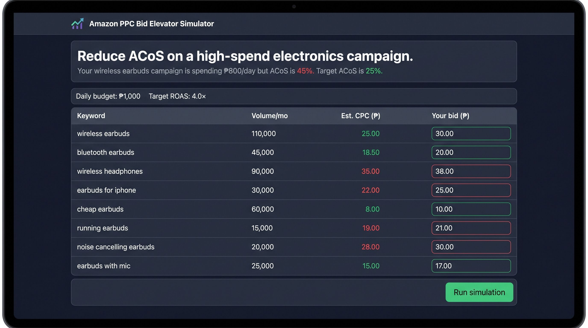
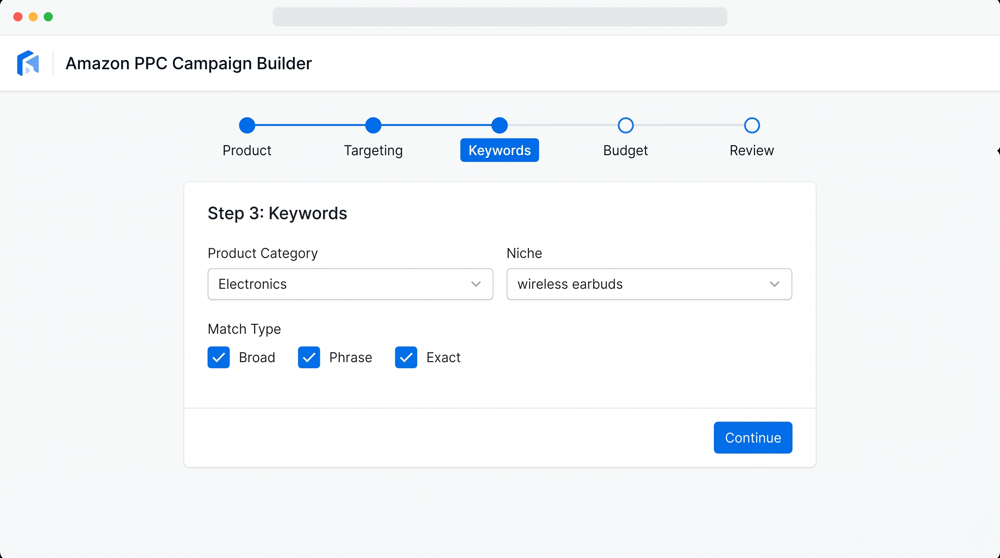
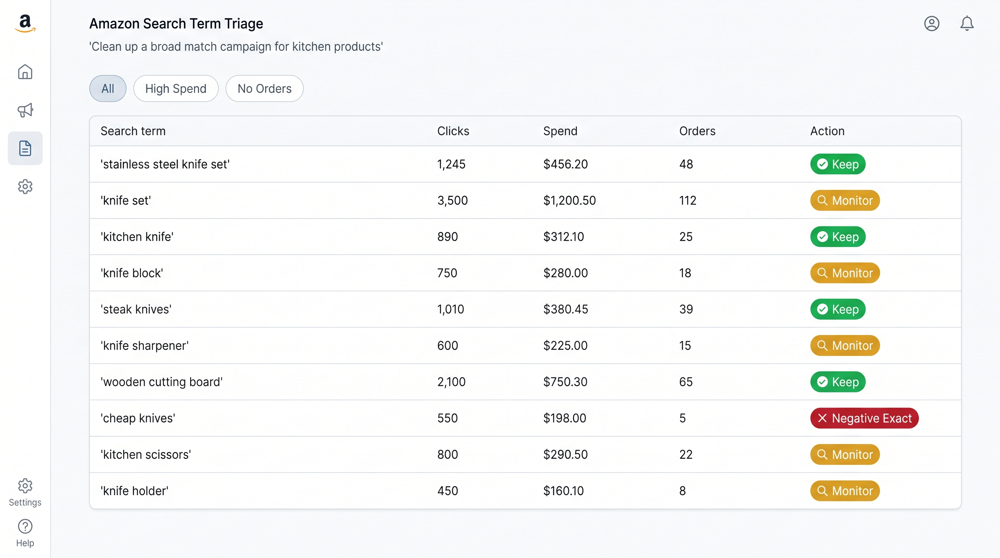
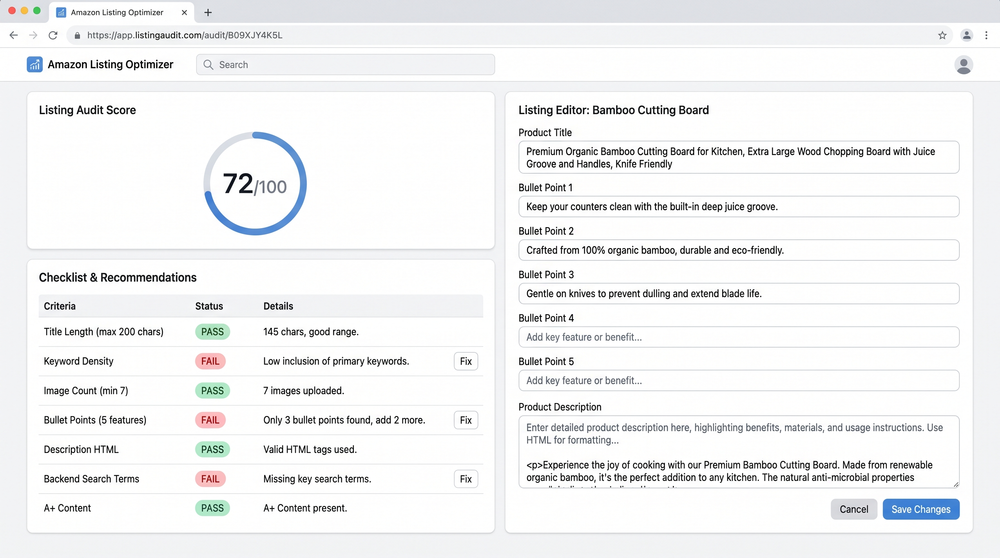
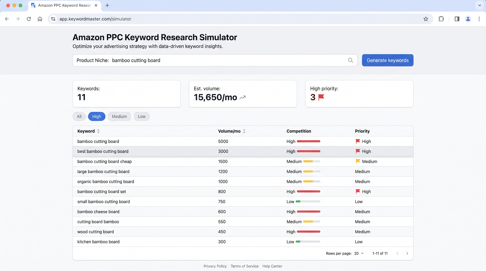

# Project Amazon PH Academy v2

Amazon PPC training for Filipino virtual assistants.

Three courses, practical tools, and a Field Manual interface. The repository contains the Next.js application, Prisma schema and migrations, curriculum importer, payment integration, admin panel, and automated tests.

**Deployment note:** `SESSION-HANDOVER.md` records the latest operator-reported deployment state. This workstation audit did not independently verify the production URL, database contents, PayMongo webhook registration, or email delivery.


## What is included

- Authentication, email verification, password reset, and optional admin TOTP.
- Course catalog, MDX curriculum import, lessons, quizzes, XP, streaks, badges, and certificates.
- PayMongo checkout, webhook processing, enrollment, discount codes, and refund workflows.
- Five registered simulator implementations, including Keyword Research as its own versioned-dataset engine.
- Admin users, courses, modules, lessons, payments, refunds, scenarios, live classes, badges, audit logs, and settings routes.
- PostgreSQL through Prisma 7, Resend email, Sentry configuration, Pino logging, Upstash rate limiting, and Vercel cron wiring.

See [`FEATURES.md`](FEATURES.md) for the implemented, partial, and planned feature matrix. Simulator scores are formative and are not certification or hiring evidence yet. See [`docs/audit-2026-07-27-completeness-review.md`](docs/audit-2026-07-27-completeness-review.md) for the current audit and known gaps.

## Curriculum and tools

The source curriculum is under `content/curriculum/`. Import it after applying migrations:

```bash
pnpm prisma:deploy
pnpm import:content
pnpm db:seed:tiers
```

The public catalog and pricing pages show empty-state copy until published course rows and active pricing-tier rows exist in the database.

Tool routes:

- `/tools/bid-elevator`
- `/tools/str-triage`
- `/tools/campaign-builder`
- `/tools/listing-audit`
- `/tools/keyword-research` (own registered simulator, STORY-081)







## 📚 Curriculum Syllabus

For a comprehensive overview of all courses, modules, and lessons taught by the platform, see **[CURRICULUM-SYLLABUS.md](CURRICULUM-SYLLABUS.md)**.

**Quick Overview:**
- **Total Duration:** ~45 hours of structured learning
- **Total XP:** ~2,700 points across 31 lessons
- **Two Main Courses:** PPC Foundations (Modules 0-4) and Accelerated Mastery (Modules 5-8)
- **Five Simulation Tools:** Bid Elevator, STR Triage, Campaign Builder, Listing Audit, Keyword Research
- **Assessment:** Module quizzes with 70% pass threshold + practical simulations

## Current repository status

| Metric                            | Verified state                                           |
| --------------------------------- | -------------------------------------------------------- |
| Architecture                      | SOLID-layered modular monolith with a composition root   |
| Framework                         | Next.js 16 App Router, TypeScript strict                 |
| Database                          | PostgreSQL through Prisma 7, 34 models and 20 migrations |
| Payments                          | PayMongo adapter and `/api/webhooks/paymongo` route      |
| Email                             | Resend adapter with React Email templates                |
| Admin                             | `/admin/*` route tree gated by `requireAdmin()`          |
| Tests                             | Vitest unit and integration tests, Playwright E2E suite  |
| Latest repository commit reviewed | `5b8072b` on 2026-07-27                                  |
| Documentation review              | `docs/audit-2026-07-27-completeness-review.md`           |

The code checks passed locally for typecheck, lint, build, and the architecture suite. The full Vitest run had two Windows path failures in the migration-contract test, and Playwright was not run because browser binaries were unavailable. Details and exact counts are in the audit report.

## Read this repo in this order

1. [`AGENTS.md`](AGENTS.md), repository rules.
2. [`CLAUDE.md`](CLAUDE.md), coding-agent guidance and known gaps.
3. [`FEATURES.md`](FEATURES.md), current feature status.
4. [`docs/audit-2026-07-27-completeness-review.md`](docs/audit-2026-07-27-completeness-review.md), verified completeness audit.
5. [`docs/product-brief.md`](docs/product-brief.md), product framing.
6. [`docs/decisions.md`](docs/decisions.md), accepted architectural decisions.
7. [`docs/build-spec.md`](docs/build-spec.md), target engineering rules.
8. [`docs/business-layer.md`](docs/business-layer.md), payment and refund rules.
9. [`docs/db-schema.md`](docs/db-schema.md), current schema inventory and divergences.
10. [`docs/api-reference.md`](docs/api-reference.md), current route, action, and use-case inventory.
11. [`docs/sprint-plan.md`](docs/sprint-plan.md), delivery plan and follow-ups.
12. [`SESSION-HANDOVER.md`](SESSION-HANDOVER.md), historical session notes and operator handoff.

## Commands

```bash
# Install and develop
pnpm install
pnpm dev

# Required quality checks
pnpm typecheck
pnpm lint
set NODE_ENV=test&& pnpm test
pnpm test:arch
pnpm test:coverage
pnpm build

# Playwright
pnpm test:e2e
pnpm test:e2e:ui

# Database
pnpm prisma:generate
pnpm prisma:validate
pnpm prisma:migrate
pnpm prisma:deploy
pnpm prisma:studio
pnpm prisma:format

# Content and seed data
pnpm import:content
pnpm db:seed:admin
pnpm db:seed:tiers
pnpm db:seed:policies
pnpm gen:secret
pnpm format
```

On Windows, use `set NODE_ENV=test&&` for local Vitest runs when `.env` or `.env.local` sets `NODE_ENV=production`. Do not run seed commands against a production database without checking `DATABASE_URL` first.

## Repository layout

```text
src/
  domain/       Pure entities, value objects, rules, and simulator logic
  ports/        Interfaces
  usecases/     Application orchestration
  infra/        Prisma, PayMongo, Resend, security, PDF, and test adapters
  app/          Next.js pages, server actions, and route handlers
  components/   UI components
  composition/  Production and test dependency wiring
  lib/          Framework-facing helpers
prisma/         Schema and append-only migrations
content/        MDX curriculum and quiz fixtures
scripts/        Import and seed commands
tests/          Architecture, integration, unit, and E2E tests
docs/           Product, architecture, operations, stories, and audit records
public/         Brand assets and screenshots
```

## License

Proprietary. © 2026 Project Amazon PH. All rights reserved.
