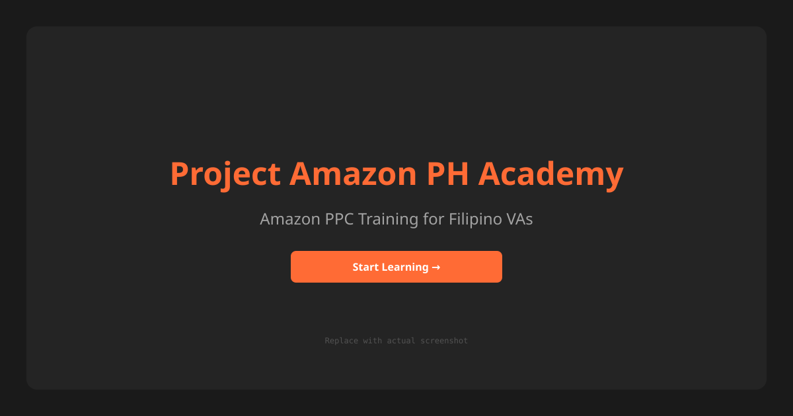

# Project Amazon PH Academy v2

Amazon PPC training for Filipino virtual assistants.

Three courses, practical tools, and a Field Manual interface. The repository contains the Next.js application, Prisma schema and migrations, curriculum importer, payment integration, admin panel, and automated tests.

**Deployment note:** `SESSION-HANDOVER.md` records the latest operator-reported deployment state. Production URL, database contents, PayMongo webhook registration, and email delivery are operator-owned and were not independently re-verified in this documentation pass.



## What is included

- Authentication, email verification, password reset, optional admin TOTP, and student TOTP (`/profile/security`).
- Course catalog, MDX curriculum import, lessons, quizzes, XP, streaks, badges, and certificates.
- PayMongo checkout (including real refunds through the PayMongo Refunds API), webhook processing, enrollment, discount codes, and refund workflows.
- Five registered simulator implementations, each with a real draft → published → archived scenario lifecycle and version history, formative-only score labeling, and (for Listing Audit and Campaign Builder) a real edit/triage UI feeding graded, persisted attempts. Keyword Research is its own versioned-dataset engine.
- A student download center (`/resources`) — guides, templates, and automation tools, with admin CRUD, file upload (Vercel Blob in production), and access-tier gating — plus an embedded Amazon Ads Console page (`/tools/ad-console`).
- Live classes with admin CRUD, student RSVP, reminder emails, and post-class recording playback with one-time completion XP.
- Editable email templates (`/admin/email-templates`) that are actually wired into every Resend send path, not just a CRUD screen.
- Account data export and self-service account deletion (`/profile/data`).
- Admin users, courses, modules, lessons, payments, refunds, scenarios (with version history), live classes, badges, resources, audit logs, and settings routes.
- PostgreSQL through Prisma 7, Resend email, Sentry configuration, Pino logging, Upstash rate limiting, and Vercel cron wiring.

See [`FEATURES.md`](FEATURES.md) for the implemented, partial, and planned feature matrix, and [`CLAUDE.md`](CLAUDE.md)'s "Known gaps" section for the most current, dated list of what's real versus still open. Simulator scores are formative and are not certification or hiring evidence yet — see [`docs/sprint-plan.md`](docs/sprint-plan.md) Sprints 14–16 for the remediation history, and [`docs/audit-2026-07-27-completeness-review.md`](docs/audit-2026-07-27-completeness-review.md) for the last full completeness audit (several of its findings have since been closed; check `CLAUDE.md` before trusting a claim from it in isolation).

## Curriculum and tools

The source curriculum is under `content/curriculum/`. Import it after applying migrations:

```bash
pnpm prisma:deploy
pnpm import:content
pnpm db:seed:tiers
```

The public catalog and pricing pages show empty-state copy until published course rows and active pricing-tier rows exist in the database.

Tool routes:

- `/tools/bid-elevator`
- `/tools/str-triage`
- `/tools/campaign-builder`
- `/tools/listing-audit`
- `/tools/keyword-research` (own registered simulator, STORY-081)
- `/tools/ad-console` — embedded Amazon Ads Console reference page (not a graded simulator)

Every simulator reads its practice content from a `SimulatorScenario` row that is currently `published` (admin-managed draft → published → archived lifecycle with version history, STORY-085) rather than a hardcoded constant, and every result view carries a formative-only notice (STORY-078) — treat all five scores as practice signal, not certification or hiring evidence.


## 📚 Curriculum Syllabus

For a comprehensive overview of all courses, modules, and lessons taught by the platform, see **[CURRICULUM-SYLLABUS.md](CURRICULUM-SYLLABUS.md)**.

**Quick Overview:**
- **Total Duration:** ~45 hours of structured learning
- **Total XP:** ~2,700 points across 31 lessons
- **Two Main Courses:** PPC Foundations (Modules 0-4) and Accelerated Mastery (Modules 5-8)
- **Five Simulation Tools:** Bid Elevator, STR Triage, Campaign Builder, Listing Audit, Keyword Research
- **Assessment:** Module quizzes with 70% pass threshold + practical simulations

## Current repository status

| Metric                            | Verified state                                                                                |
| --------------------------------- | ---------------------------------------------------------------------------------------------- |
| Architecture                      | SOLID-layered modular monolith with a composition root                                        |
| Framework                         | Next.js 16 App Router, TypeScript strict                                                      |
| Database                          | PostgreSQL through Prisma 7, 36 models and 35 migrations                                      |
| Payments                          | PayMongo adapter (checkout + real Refunds API) and `/api/webhooks/paymongo` route              |
| Email                             | Resend adapter with React Email templates, wired to admin-editable overrides                  |
| Admin                             | `/admin/*` route tree gated by `requireAdmin()`, 12 sub-areas including resources              |
| Simulators                        | 5 registered engines with versioned/published scenarios and formative-only scoring            |
| Tests                             | Vitest unit and integration tests, Playwright E2E suite, a dedicated architecture-compliance suite (`pnpm test:arch`) |
| Latest repository commit reviewed | `ff86065` on 2026-08-04 (Sprint 16 + STORY-083/084 + review-comment fixes)                     |
| Documentation review              | `CLAUDE.md` "Known gaps" (dated, kept current), `docs/sprint-plan.md`, `SESSION-HANDOVER.md`   |

Sprints 1–13 (foundation through admin panel round 2) are fully implemented. Sprint 14 (simulator scoring integrity, STORY-071–077) is complete. Sprint 15 (certification safety + subject-matter accuracy, STORY-078–084) is complete — Listing Audit's non-binary ground truth and Campaign Builder's strategic scoring, both requiring the product owner's own Amazon PPC judgment, shipped 2026-08-04. Sprint 16 (assessment platform maturity) is 3 of 5 stories done (STORY-085, 087, 088); STORY-086 (instructor calibration) and STORY-089 (connected-account simulator) remain planned with no story doc yet. See "Planned work" below for the full breakdown.

Historically, `pnpm typecheck`, `pnpm lint`, `pnpm build`, and `pnpm test:arch` have passed cleanly at every session's checkpoint per `SESSION-HANDOVER.md`; the full Vitest suite was last reported at roughly 3,500 passing / 2 skipped (2026-08-03) and has grown with each story since. This pass did not re-run the suite (no database configured in this session) — re-verify with the commands below before relying on an exact count.

## Planned work and known gaps

Not exhaustive — `CLAUDE.md`'s "Known gaps" section is the dated, actively-maintained source of truth; this is a summary for orientation.

**Planned, no code yet:**

- **STORY-086** — instructor calibration + acceptable-answer ranges for simulator grading. No story doc exists.
- **STORY-089** — a connected-account simulator variant. No story doc exists.

**Partial / real but incomplete:**

- **Keyword Research** dataset covers 4 of the story's 12 launch niches, and every dataset is `synthetic_calibrated` — credential-mode attempts are rejected pending real seller-export data (STORY-081b, unplanned).
- **Listing Audit's difficulty-scaled finding-volume** acceptance criterion (STORY-080) is not implemented.
- **Account data export** (`/profile/data`) omits quiz and simulator attempt history — the repositories only support per-quiz/per-scenario lookups, not "every attempt by this user."
- **Email template placeholders**: an admin-customized email field replaces the default copy verbatim; there is no `{{firstName}}`-style interpolation. `RefundEmail`'s `ctaLabel` field has no corresponding UI to render it.
- **Admin two-factor authentication** is opt-in only — nothing enforces it, and account lockout (`lockedUntil`) has no enforcement path either.
- **Local file storage** (`LocalFileStorage`, used when `BLOB_READ_WRITE_TOKEN` is unset) does not persist on Vercel's read-only serverless filesystem; production fails closed instead of silently falling back to it.

**Operator-owned, not delegable to an agent:**

- A live database backup/restore drill (a runbook exists; never executed against a real Neon project).
- External uptime monitoring (needs a third-party account).
- Launch communications.
- PayMongo live webhook secret rotation drills.

**Documentation drift to watch for:** `FEATURES.md` was last reviewed 2026-08-02 and predates Sprint 16, the download center, and the embedded Ad Console page — cross-check it against `CLAUDE.md`'s dated addenda and `docs/sprint-plan.md` before trusting a status claim there in isolation. `CHANGELOG.md`'s "Unreleased" section does not yet have entries for STORY-087/088 even though `docs/sprint-plan.md` and their own story docs mark them done 2026-08-04 — worth a follow-up changelog entry.

## Read this repo in this order

1. [`AGENTS.md`](AGENTS.md), repository rules.
2. [`CLAUDE.md`](CLAUDE.md), coding-agent guidance and the actively-maintained, dated "Known gaps" section — read this before trusting any older doc's completeness claims.
3. [`FEATURES.md`](FEATURES.md), feature status matrix (stale as of 2026-08-02; cross-check against `CLAUDE.md`).
4. [`docs/sprint-plan.md`](docs/sprint-plan.md), delivery plan, sprint-by-sprint story status through Sprint 16.
5. [`docs/audit-2026-07-27-completeness-review.md`](docs/audit-2026-07-27-completeness-review.md), the last full completeness audit (historical baseline, superseded in places by `CLAUDE.md`).
6. [`docs/product-brief.md`](docs/product-brief.md), product framing.
7. [`docs/decisions.md`](docs/decisions.md), accepted architectural decisions.
8. [`docs/build-spec.md`](docs/build-spec.md), target engineering rules.
9. [`docs/business-layer.md`](docs/business-layer.md), payment and refund rules.
10. [`docs/db-schema.md`](docs/db-schema.md), current schema inventory and divergences.
11. [`docs/api-reference.md`](docs/api-reference.md), current route, action, and use-case inventory.
12. [`SESSION-HANDOVER.md`](SESSION-HANDOVER.md), session-by-session history and operator handoff, most recent entry first.
13. [`CHANGELOG.md`](CHANGELOG.md), dated, one-entry-per-change log of shipped work.

## Commands

```bash
# Install and develop
pnpm install
pnpm dev

# Required quality checks
pnpm typecheck
pnpm lint
set NODE_ENV=test&& pnpm test
pnpm test:arch
pnpm test:coverage
pnpm build

# Playwright
pnpm test:e2e
pnpm test:e2e:ui

# Database
pnpm prisma:generate
pnpm prisma:validate
pnpm prisma:migrate
pnpm prisma:deploy
pnpm prisma:studio
pnpm prisma:format

# Content and seed data
pnpm import:content
pnpm db:seed:admin
pnpm db:seed:tiers
pnpm db:seed:policies
pnpm db:seed:scenarios
pnpm db:seed:resources
pnpm gen:secret
pnpm format
```

On Windows, use `set NODE_ENV=test&&` for local Vitest runs when `.env` or `.env.local` sets `NODE_ENV=production`. Do not run seed commands against a production database without checking `DATABASE_URL` first.

## Repository layout

```text
src/
  domain/       Pure entities, value objects, rules, and simulator logic
  ports/        Interfaces
  usecases/     Application orchestration
  infra/        Prisma, PayMongo, Resend, security, PDF, and test adapters
  app/          Next.js pages, server actions, and route handlers
  components/   UI components
  composition/  Production and test dependency wiring
  lib/          Framework-facing helpers
prisma/         Schema and append-only migrations
content/        MDX curriculum and quiz fixtures
scripts/        Import and seed commands
tests/          Architecture, integration, unit, and E2E tests
docs/           Product, architecture, operations, stories, and audit records
public/         Brand assets and screenshots
```

## License

Proprietary. © 2026 Project Amazon PH. All rights reserved.
