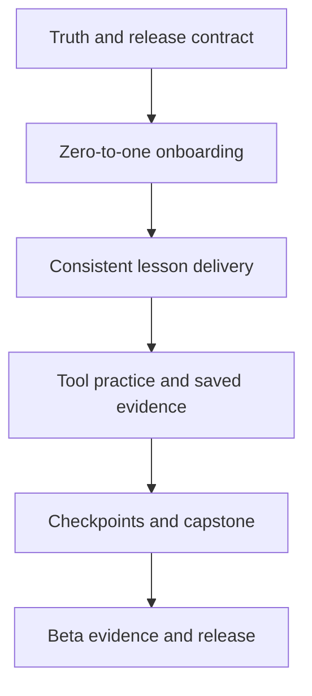

# Learning Experience 8.5 Build Plan

**Status:** Planned

**Owner:** Ryan Roland Dabao

**Date:** 2026-08-16

**Decision:** Build a zero-to-one, evidence-producing learning journey before adding breadth. The Academy should help a complete beginner make and explain safe PPC decisions, then leave with reviewable client-work artefacts. It must not represent formative simulator scores as job-readiness proof.

## Why this plan exists

The current Academy has real foundations: MDX lessons, course and lesson access, progress, quizzes, five registered simulators, resource delivery, live-class support, and formative simulator feedback. The gaps are in how those parts form one beginner journey.

The student-facing review identified five targets that must each reach at least 8.5/10:

| Area | Current concern | 8.5 outcome |
| --- | --- | --- |
| Structure | The sequence is sensible, but its job outcomes and prerequisites are not obvious to a novice. | Every module has a visible purpose, prerequisite, practice, assessment, and next step. |
| Beginner friendliness | Acronyms and platform language arrive before a learner has a working mental model. | A learner can explain the PPC work loop and finish a first safe decision in 20 minutes. |
| Delivery | Strong written material is unevenly active and visually dense. | Every lesson follows one learn, see, try, explain pattern. |
| Completeness | A learner can study mechanics without producing the client deliverables a PPC VA is hired to make. | Completion includes a reviewable portfolio and a client-facing weekly readout. |
| Trust and readiness | Public time, tier, and tool claims can drift from source content and availability. | Every promise is derived from, or verified against, a single current source of truth. |

This is an implementation plan, not a claim that the target has already been achieved. Existing course, quiz, resource, simulator, and live-class systems are inputs to this work. They should be extended, not duplicated.

## Product guardrails

1. **Beginner first.** Define a term before asking a learner to use it. Explain the job before teaching the control.
2. **Practice before confidence claims.** Simulators remain formative. A passing score alone must not issue a job-readiness statement, hiring signal, or certificate.
3. **One source of truth.** The content inventory, tier entitlement, and public claim must agree before release.
4. **Evidence belongs to the learner.** Worksheets, decision logs, and capstone work must be saved and exportable, not left as text in a completed lesson.
5. **Human review is a tiered service.** Automated feedback can direct the next attempt. Only an explicit reviewer can make a human quality judgment.
6. **No sixth simulator by accident.** The weekly client readout starts as a resource-backed structured assignment. A new simulator requires the domain and registry path required by `AGENTS.md`.
7. **No live-account promise.** The programme teaches safe practice and accountable decision-making. It does not grant access to a client account or guarantee employment.

## Existing work this plan carries forward

| Existing item | Role in this plan | Required action |
| --- | --- | --- |
| STORY-107, curriculum voice stabilization | Supports the lesson delivery standard. | Complete it module by module under LEARN-021 through LEARN-029. |
| STORY-108, curriculum media expansion | Supports visual learning and reduced reading fatigue. | Retain only media that explains a decision. Ship against the lesson renderer contract. |
| STORY-109, simulation-prep gaps | Gives Modules 1, 3, and 6 better practice bridges. | Keep the shipped lessons and add saved evidence in LEARN-034. |
| STORY-110, landing beginner voice | Removes avoidable beginner friction on the public page. | Keep its tone rules and reconcile public availability claims in LEARN-003 and LEARN-004. |
| Existing resource centre | Already delivers gated guides and templates. | Publish the job-ready resource pack through it in LEARN-050. |
| Existing simulator attempt lifecycle | Already persists practice decisions and feedback. | Add lesson handoffs, scenario packs, and debrief links. Do not replace it. |
| Existing quiz route and attempts | Already assesses module quizzes. | Add diagnostic, retrieval, and remediation contracts without weakening access checks. |

## Delivery sequence

No later phase may use public promises that have not passed the truth-and-release contract. Content production can run alongside platform planning after the lesson contract is approved, but a module must not ship until its learner path, practice, and evidence are connected.

## Atomic build backlog

Each item is one mergeable concern. A ticket may create a story document when work starts, but it must not be bundled with unrelated cleanup. "Depends on" lists hard dependencies only.

### Wave 0. Truth and release contract

| ID | Atomic outcome | Depends on | Likely surfaces | Acceptance evidence |
| --- | --- | --- | --- | --- |
| LEARN-001 | Create a machine-readable curriculum and offer inventory that lists every published lesson, planned minutes, XP, course/tier, tool bridge, resource, and final deliverable. | None | `content/curriculum/`, importer or a build-time inventory, validation test | The inventory counts all source lessons and rejects duplicate slugs, missing tier mappings, missing minutes, and missing tool targets. |
| LEARN-002 | Persist and read planned duration for text lessons. Do not calculate course time from VIDEO rows only. | LEARN-001 | `Lesson` domain model, Prisma migration, repositories, importer, catalog use cases, tests | Source frontmatter, course catalogue, course detail, and student lesson header agree on planned minutes. |
| LEARN-003 | Make public curriculum, tier, simulator, and certificate claims consume the approved inventory or one reviewed product-claim config. | LEARN-001, LEARN-002 | Landing curriculum/pricing/simulator sections, course catalogue, claim contract test | A test fails if a public lesson count, time, tier inclusion, or tool availability differs from the inventory. |
| LEARN-004 | Remove misleading loading states from programme statistics and tool availability. Use a visible stable value before count-up animation, and clearly distinguish public preview, enrolled practice, and unavailable work. | LEARN-003 | `StatsStrip`, landing simulator section, accessibility tests | Initial render never presents zero as a programme fact. A screen-reader and no-JavaScript state receive the same truthful programme summary. |
| LEARN-005 | Define the content publishing checklist and release gate. Importing content, publishing resources, and changing claims must be separate, ordered operations. | LEARN-001 to LEARN-004 | Runbook, CI check, release checklist | A release cannot mark content live until import output, public claim validation, and a logged-in learner smoke test are recorded. Implemented in `docs/runbooks/learning-release-gate.md` and the `Learning release gate` CI job. |
| LEARN-006 | Make the lesson renderer responsive and readable for Markdown-heavy curriculum content. Keep tables aligned, long prompts contained, and block spacing predictable on desktop and mobile. | LEARN-001 | `LessonContent`, lesson page styles, responsive regression tests | GFM tables stay inside the reading column with intentional overflow on narrow screens; quiz prompts and lesson blocks do not overlap or introduce horizontal page scroll. |

### Wave 1. Zero-to-one onboarding

| ID | Atomic outcome | Depends on | Likely surfaces | Acceptance evidence |
| --- | --- | --- | --- | --- |
| LEARN-010 | Add a short, optional pre-course diagnostic. It sets learner expectations and confidence; it does not skip required safety foundations or gate paid content. | LEARN-001 | Quiz model/seed content, onboarding route, analytics event | Results identify a learner as new, familiar, or experienced and recommend a starting emphasis without changing entitlement. |
| LEARN-011 | Add the first Module 0 lesson: what an Amazon PPC VA does, what is in scope, and what is not. | LEARN-001 | `content/curriculum/modules/0-onboarding/` | A learner can name the daily work loop: read, decide, change, explain. |
| LEARN-012 | Add the PPC system map lesson: shopper search, listing, campaign, bid, spend, sale, report. | LEARN-011 | Module 0 MDX, annotated diagram asset | It defines each term before use and gives one end-to-end example in Philippine VA context. |
| LEARN-013 | Give learners a just-in-time glossary component and authoring syntax. Do not turn every lesson into a glossary page. | LEARN-011 | Lesson renderer, glossary data, unit and accessibility tests | Defined terms expose concise definitions on keyboard and touch; plain MDX remains readable if JavaScript is unavailable. |
| LEARN-014 | Create a guided first-decision route to an existing practice-mode Bid Elevator scenario. It must preload the beginner scenario and explain the result. | LEARN-012 | Existing tool route, scenario data, lesson-to-tool handoff | A new learner finishes one constrained decision without opening a live account or being graded as job-ready. |
| LEARN-015 | Add the onboarding completion view: plain-language pathway, next action, expected time, and where to get help. | LEARN-010 to LEARN-014 | Dashboard/course page, lesson completion view | A learner who completes Module 0 can name the next lesson and access it in one action. |

### Wave 2. Consistent lesson delivery

The content contract is deliberately small. Every lesson must include: a job situation, one decision, a concise explanation, a worked example, an active attempt, feedback or an answer reveal, an evidence instruction, and a retrieval cue. Not every lesson needs video; procedural lessons need annotated walkthroughs or a short captioned screencast.

| ID | Atomic outcome | Depends on | Likely surfaces | Acceptance evidence |
| --- | --- | --- | --- | --- |
| LEARN-020 | Define the lesson production schema and lintable content checklist. | LEARN-001 | MDX conventions, parser/validation tests, author guide | CI reports missing required lesson blocks and invalid links without checking prose style mechanically. Implemented in `scripts/validate-lesson-production.ts` and the uploaded CI report. |
| LEARN-021 | Ship the voice and active-practice pass for Module 0. | LEARN-020 | Module 0 content | All onboarding lessons follow the production schema and pass the read-aloud review. |
| LEARN-022 | Ship the voice and active-practice pass for Module 1. | LEARN-020 | Module 1 content | Every quantitative concept has a worked calculation and an independent calculation. |
| LEARN-023 | Ship the voice, visual, and practice pass for Module 2. | LEARN-020 | Module 2 content, match-type visual | Keyword lessons finish with a usable keyword grouping decision. |
| LEARN-024 | Ship the voice, visual, and practice pass for Module 3. | LEARN-020 | Module 3 content, Listing Audit bridge | Listing lessons finish with an audit rationale, not just a tool link. |
| LEARN-025 | Ship the voice, visual, and practice pass for Module 4. | LEARN-020 | Module 4 content, Campaign Builder bridge | Campaign structure lessons finish with a campaign map and pre-flight rationale. |
| LEARN-026 | Ship the voice, visual, and practice pass for Module 5. Add the client-reporting and escalation bridge. | LEARN-020 | Module 5 content, reporting assignment | Portfolio, budget, and seasonality decisions lead to a weekly client readout. |
| LEARN-027 | Ship the voice, visual, and practice pass for Module 6. | LEARN-020 | Module 6 content, Bid Elevator bridge | Bid lessons finish with a guardrail and a recorded reason for the action. |
| LEARN-028 | Ship the voice, visual, and practice pass for Module 7. | LEARN-020 | Module 7 content, STR Triage bridge | Triage lessons finish with a defensible action and negative-keyword rationale. |
| LEARN-029 | Ship the voice, visual, and practice pass for Module 8. | LEARN-020 | Module 8 content | Competitive insights are translated into a decision, not presented as data trivia. |

### Wave 3. Tool practice and saved evidence

| ID | Atomic outcome | Depends on | Likely surfaces | Acceptance evidence |
| --- | --- | --- | --- | --- |
| LEARN-030 | Add a typed lesson-to-tool bridge registry. A bridge identifies one eligible tool, scenario, learner instruction, and debrief destination. | LEARN-001, LEARN-020 | Registry, course lesson UI, tool routes, tests | A broken tool route, tier mismatch, or unpublished scenario fails validation before release. |
| LEARN-031 | Author beginner, independent, and messy-client scenario packs for each existing simulator. | LEARN-030 | Admin scenario lifecycle, seed/import data | Each tool has at least three distinct instructional scenarios and one outcome explanation reviewed by the PPC owner. |
| LEARN-032 | Add the tool debrief pattern: result, why it matters, targeted lesson revisit, retry, and a prompt to state the rationale. | LEARN-030 | Existing simulator result views, feedback composer | A learner can reach the relevant lesson or retry without losing the completed attempt record. |
| LEARN-033 | Add a learner artefact domain for structured outputs: decision log, listing audit, keyword plan, campaign map, triage report, and weekly readout. | LEARN-020 | Domain entity, port, repository, migration, use cases, server actions, tests | Artefacts are private to the owner by default, access-controlled, versioned or immutable by submission, and exportable. |
| LEARN-034 | Save artefacts from the five tool debriefs and the Module 5 reporting assignment. | LEARN-031 to LEARN-033 | Tool result views, lesson assignment UI | Each required practice activity produces a named artefact with its scenario, rationale, and created date. |
| LEARN-035 | Build the student portfolio page from saved artefacts. | LEARN-033, LEARN-034 | `/portfolio`, dashboard link, export route, access tests | A learner can view and export only their own artefacts. No simulator percentage is labelled as certification. |

### Wave 4. Assessment, capstone, and support

| ID | Atomic outcome | Depends on | Likely surfaces | Acceptance evidence |
| --- | --- | --- | --- | --- |
| LEARN-040 | Add one tracked mid-lesson retrieval check to the production schema and ship it in Module 1 as the reference implementation. | LEARN-020 | Quiz question data, lesson UI, attempt tracking | It gives immediate explanation and does not block a learner for one mistake. |
| LEARN-041 | Add targeted remediation to existing module-final quizzes. A failed attempt identifies the lessons and practice items to revisit before retry. | LEARN-040 | Quiz attempt review, lesson links, tests | Review advice is derived from question tags, not generic "try again" text. |
| LEARN-042 | Define the Foundations capstone brief, rubric, and required artefacts. | LEARN-033 to LEARN-035 | Content, rubric data, admin review preparation | The brief requires listing audit, keyword plan, campaign map, bid guardrail, triage decision, and weekly client update. |
| LEARN-043 | Implement capstone submission and readiness state. Passing the capstone awards completion evidence, not an automatic employment claim. | LEARN-042 | Submission use case, progress/certificate policy, tests | A submission is auditable, can be revised, and cannot be marked passed without the rubric requirements. |
| LEARN-044 | Add a reviewer queue and rubric workflow for the human-review tier. | LEARN-043 | Admin route, audit logging, reviewer actions | Every reviewer action is authorised, audit-logged, and visible to the learner with actionable feedback. |
| LEARN-045 | Add a lightweight help route: common blockers, escalation boundaries, and the approved path for support or live-class questions. | LEARN-015 | Student navigation, support content | Every lesson and tool has a consistent route to help without promising real-time support where none exists. |

### Wave 5. Job-ready resource pack and learning home

| ID | Atomic outcome | Depends on | Likely surfaces | Acceptance evidence |
| --- | --- | --- | --- | --- |
| LEARN-050 | Publish a first resource pack through the existing resource centre: keyword scoring worksheet, campaign pre-flight checklist, negative keyword log, ACoS/bid calculator, weekly client report, and PPC account onboarding SOP. | LEARN-001 | Resource records, files/links, admin publishing, download tests | Every resource has an owner, tier, associated lesson, version date, worked example, and blank working copy. |
| LEARN-051 | Add the job-readiness learning layer: client brief intake, access and confidentiality, escalation, client reporting, and portfolio presentation. | LEARN-026, LEARN-050 | New or expanded lesson content and resources | The capability map has no unowned client-work outcome. |
| LEARN-052 | Replace dashboard "continue where you enrolled" with the next incomplete learning action. | LEARN-001 | Progress read model, dashboard, tests | The dashboard points to the earliest eligible incomplete lesson, practice, or revision task, not merely the newest enrollment. |
| LEARN-053 | Add a learning home summary: next action, current skill evidence, available resources, and capstone readiness. | LEARN-035, LEARN-052 | Dashboard and portfolio read model | The page explains why a learner should do the next item and does not expose another learner's data. |

### Wave 6. Measurement, beta, and release

| ID | Atomic outcome | Depends on | Likely surfaces | Acceptance evidence |
| --- | --- | --- | --- | --- |
| LEARN-060 | Define privacy-safe learning events for diagnostic completion, first decision, lesson retrieval checks, tool attempt, artefact saved, checkpoint, and capstone status. | LEARN-010, LEARN-033, LEARN-040, LEARN-043 | Event schema, analytics adapter, data-export contract | Events are documented, minimised, and included in the student's account-data export where applicable. |
| LEARN-061 | Run a moderated beta with 10 to 15 people who have never managed Amazon ads. | LEARN-015, LEARN-029, LEARN-034, LEARN-043 | Research protocol and observation sheet | At least 80% complete the first decision and explain the work loop without facilitator rescue. |
| LEARN-062 | Resolve beta blockers and publish a release scorecard. | LEARN-061 | Backlog, release notes, quality gate | The scorecard reports beginner comprehension, practice completion, artefact completion, trust findings, and unresolved risk. |
| LEARN-063 | Run the production release gate with both a public visitor and an enrolled learner path. | LEARN-005, LEARN-062 | CI, preview, production smoke checklist | Public claims, tier access, minutes, tool bridges, saved artefacts, and export are verified in the deployed environment. |

## Suggested implementation releases

| Release | Scope | Exit condition |
| --- | --- | --- |
| R1, honest foundation | LEARN-001 to LEARN-005 | No public claim can drift from course data; marketing states current availability. |
| R2, first 20 minutes | LEARN-010 to LEARN-015 | A true beginner completes onboarding and a guided decision. |
| R3, active curriculum | LEARN-020 to LEARN-032 | Every module has one consistent active-practice flow and a verified tool bridge where appropriate. |
| R4, evidence and assessment | LEARN-033 to LEARN-045 | Practice becomes saved work; Foundations has a rubric-backed capstone and human review path. |
| R5, career proof | LEARN-050 to LEARN-053 | Learners can use the resource pack and present their work from one learning home. |
| R6, measured launch | LEARN-060 to LEARN-063 | Beginner beta and production gate demonstrate the 8.5 targets with evidence. |

## Definition of done for every build item

1. The story names one learner-visible behavior and its owner.
2. The data contract, access rule, and dependency direction match `AGENTS.md`.
3. A focused test fails before the implementation when practical, then passes after it.
4. New student routes include loading and error states, keyboard access, mobile verification, and course entitlement checks.
5. New admin mutation paths record `AuditLog` events.
6. New content passes frontmatter, link, voice, accessibility, and source inventory checks.
7. Any content source change is imported into a non-production target, checked as an enrolled learner, then explicitly approved for production import.
8. The public site never claims an unshipped tool, inflated time estimate, job readiness, or a human review that the selected tier does not include.
9. The feature inventory, story status, student-gap audit, release notes, and runbook are updated in the same feature change when applicable.

## Scorecard

The 8.5 target is a release decision based on learner evidence, not an internal preference score.

| Area | Measure | 8.5 threshold |
| --- | --- | --- |
| Beginner friendliness | New learners who can explain the PPC work loop after Module 0 | 80% or more |
| Onboarding activation | New learners who complete the first guided decision | 80% or more |
| Lesson delivery | Learners who complete the independent activity after a lesson | 85% or more |
| Practice transfer | Learners who can explain the reason for a simulator action | 80% or more |
| Portfolio completeness | Foundations learners with all required evidence before capstone review | 80% or more |
| Assessment usefulness | Learners who act on targeted remediation before a successful retry | 70% or more |
| Trust | Material claim mismatches found in release validation | Zero |
| Learner rating | Post-Foundations rating from true beginners | 8.5/10 or higher |

## Explicit non-goals for this programme

- Replacing the five existing simulators or treating them as employment credentials.
- Adding Amazon DSP, connected live accounts, or third-party-tool walkthroughs before the Foundations capstone proves the core journey.
- Requiring video for every lesson. Video is reserved for procedures where it improves performance.
- Building a social network, AI mentor, or automated hiring judgment.
- Promising income, a client placement, or independent live-account capability upon course completion.

## Documentation ownership

This plan is the source for the learning-experience roadmap. Supporting documents have distinct roles:

| Document | Role |
| --- | --- |
| `docs/LEARNING-EXPERIENCE-8.5-BUILD-PLAN.md` | Atomic backlog, dependencies, release gates, and measurable outcome. |
| `docs/sprint-plan.md` | High-level planning pointer and existing story status. |
| `FEATURES.md` | What ships now versus what remains planned. |
| `STATE.md` | Current priority and operational warning. |
| `content/README.md` | Curriculum source, import workflow, and content validation rules. |
| `docs/STUDENT-FEATURE-GAP-ANALYSIS.md` | Verified implementation gaps only. Update it when a build item closes a measured gap. |
