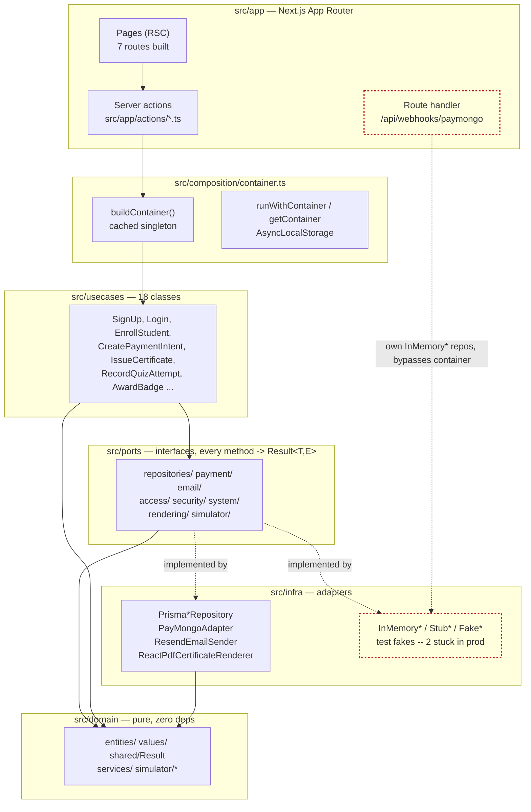

# Layer wiring — current reality

The five layers as they are actually wired in `src/composition/container.ts` today, including the two production gaps documented in `CLAUDE.md`: `courseRepo`/`orderRepo` resolve to in-memory implementations, and the PayMongo webhook route never touches the container at all.

Dashed red = the known gap. **courseRepo** and **orderRepo** resolve to `InMemory*` inside `buildProductionContainer()` — courses and orders are not Postgres-backed in production yet. The webhook route re-instantiates its own `InMemory*` repos per request, so it cannot see orders created anywhere else in the app (there's a literal `TODO: wire Prisma* repos in STORY-023 follow-up` in that file).
