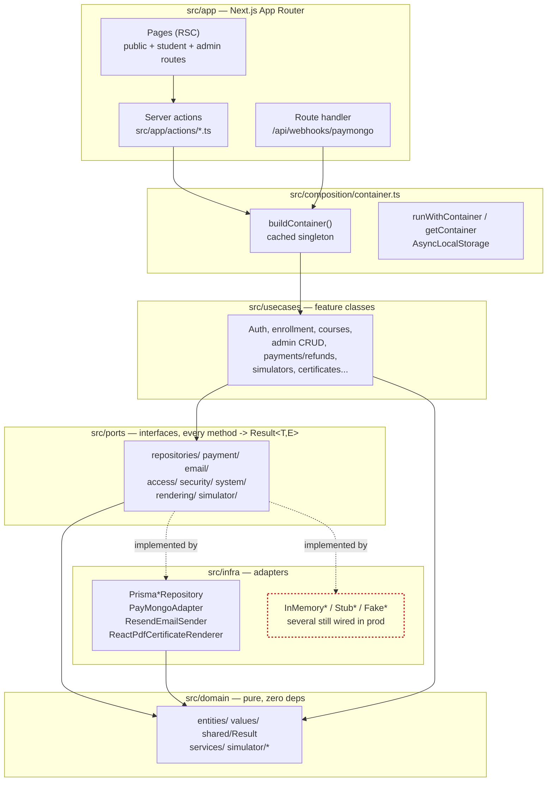

# Layer wiring — current reality

The five layers as they are currently wired in `src/composition/container.ts`.

Dashed red = remaining production gaps. The webhook route now uses `buildContainer()`, and `courseRepo` is Prisma-backed. The still-in-memory production adapters are `orderRepo`, `moduleRepo`, `lessonRepo`, `discountCodeRepo`, `liveClassRepo`, `scenarioRepo`, `sessionRepo`, and `auditLog`.
