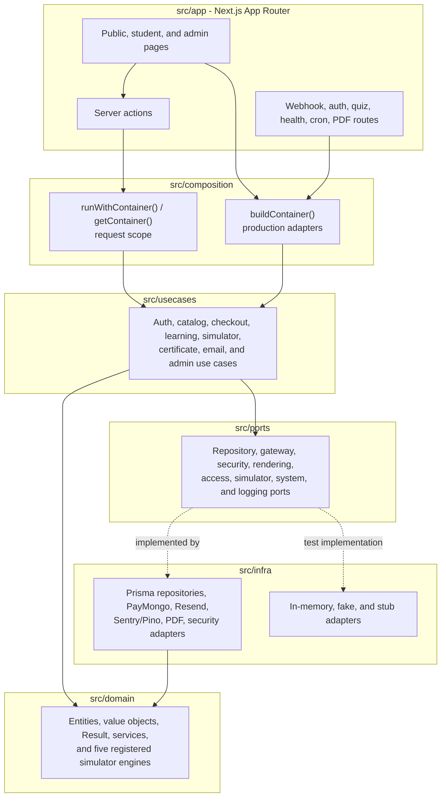

# Current layer wiring

**Reviewed:** 2026-08-14 against `6c61fc3`
**Source of truth:** `src/composition/container.ts`

The application is a modular monolith. Pages and server actions depend on use cases, use cases depend on ports and domain rules, and production adapters implement the ports. `domain/` remains framework-free. `buildContainer()` creates the production composition, while `container.test.ts` wires deterministic in-memory adapters for tests.

```mermaid
flowchart TB
  subgraph APP["src/app - Next.js App Router"]
    PAGES["Public, student, and admin pages"]
    ACTIONS["Server actions"]
    ROUTES["Webhook, auth, quiz, health, cron, PDF routes"]
  end

  subgraph COMPOSITION["src/composition"]
    CONTAINER["buildContainer()\nproduction adapters"]
    SCOPE["runWithContainer() / getContainer()\nrequest scope"]
  end

  subgraph USECASES["src/usecases"]
    UC["Auth, catalog, checkout, learning, simulator,\ncertificate, email, and admin use cases"]
  end

  subgraph PORTS["src/ports"]
    PORT["Repository, gateway, security, rendering,\naccess, simulator, system, and logging ports"]
  end

  subgraph DOMAIN["src/domain"]
    RULES["Entities, value objects, Result, services,\nand five registered simulator engines"]
  end

  subgraph INFRA["src/infra"]
    PROD["Prisma repositories, PayMongo, Resend,\nSentry/Pino, PDF, security adapters"]
    TEST["In-memory, fake, and stub adapters"]
  end

  PAGES --> ACTIONS
  PAGES --> CONTAINER
  ROUTES --> CONTAINER
  ACTIONS --> SCOPE --> UC
  CONTAINER --> UC
  UC --> PORT
  UC --> RULES
  PORT -. implemented by .-> PROD
  PORT -. test implementation .-> TEST
  PROD --> RULES
```

## Production adapter status

Most persisted repositories in `buildProductionContainer()` use Prisma adapters, including users, courses, modules, lessons, orders, enrollments, sessions, discount codes, quizzes, attempts, XP, certificates, audit logs, webhook events, simulator scenarios and attempts, score policies, feedback, live classes, pricing tiers, email verification, password reset, and sent reminders.

Current notes:

- Badge mutations use the Prisma adapter.
- Graded simulator actions use the authenticated user ID.
- Dashboard pending refunds come from `orderRepo.listRefundRequests()`.
- `scripts/seed-admin-user.mjs` uses the PrismaPg driver adapter.
- Live-class registrations and watched-recording state use the Prisma adapter in production.

The PayMongo webhook uses `buildContainer()`, verifies the signature through `PayMongoAdapter`, persists a `WebhookEvent`, and then processes the order. The historical claim that it creates in-memory repositories per request is no longer true.
