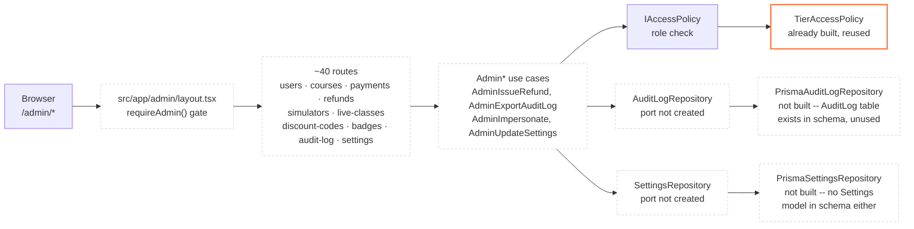

# Admin panel wiring — planned (Sprint 10, nothing built)

Layout per `docs/admin-backend.md` §"What Lives Where". No `src/app/admin` directory, no `requireAdmin()`, and no `AuditLogRepository`/`SettingsRepository` ports exist yet.

Solid orange = the one piece that already exists and gets reused as-is (**TierAccessPolicy**). Everything dashed is Sprint 10 scope per `docs/sprint-plan.md` — including a **SettingsRepository** port and **Settings** Prisma model that don't exist yet at all.
