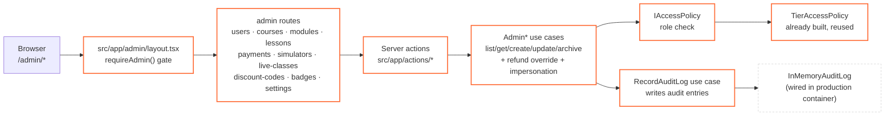

# Admin panel wiring — implemented surface

Layout mirrors the current `src/app/admin/*` tree. Admin routes are server components gated by `requireAdmin()` in `src/app/admin/layout.tsx`, with defense-in-depth checks in action/page boundaries.

Solid orange = implemented and wired. Dashed gray = remaining persistence gap. Admin audit writes are wired through `RecordAuditLog`, but the production container still uses `InMemoryAuditLog` rather than a Prisma-backed audit repository.
