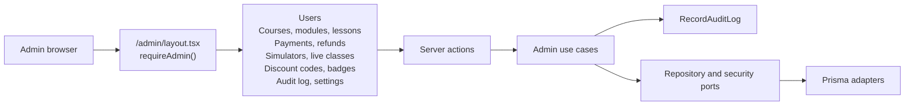

# Admin panel wiring

**Reviewed:** 2026-08-12 against `ee1737a`
**Gate:** `src/app/admin/layout.tsx` calls `requireAdmin()` before nested admin pages render.  
**Composition:** `src/composition/container.ts` wires the admin use cases to production ports.

```mermaid
flowchart LR
  BROWSER["Admin browser"] --> GATE["/admin/layout.tsx\nrequireAdmin()"]
  GATE --> ROUTES["Users\nCourses, modules, lessons\nPayments, refunds\nSimulators, live classes\nDiscount codes, badges\nAudit log, settings"]
  ROUTES --> ACTIONS["Server actions"]
  ACTIONS --> UC["Admin use cases"]
  UC --> AUDIT["RecordAuditLog"]
  UC --> PORTS["Repository and security ports"]
  PORTS --> PRISMA["Prisma adapters"]
```

## Implemented route groups

| Group          | Routes                                                                      | State                                                                                             |
| -------------- | --------------------------------------------------------------------------- | ------------------------------------------------------------------------------------------------- |
| Dashboard      | `/admin`                                                                    | Implemented; pending refunds come from persisted orders                                           |
| Users          | `/admin/users`, `/admin/users/[id]`                                         | Implemented; tier grants create eligible enrollments and impersonation restores the admin session |
| Courses        | `/admin/courses` and nested editors                                         | Implemented; module and lesson writes rebuild the course curriculum cache                         |
| Payments       | `/admin/payments`, `/admin/payments/[id]`                                   | Implemented                                                                                       |
| Refunds        | `/admin/refunds`, `/admin/refunds/[orderId]`                                | Implemented                                                                                       |
| Simulators     | `/admin/simulators`, `/admin/simulators/new`, `/admin/simulators/[id]/edit` | Implemented for scenario CRUD                                                                     |
| Live classes   | `/admin/live-classes` and create/edit pages                                 | Implemented for admin CRUD and reminder scheduling                                                |
| Discount codes | `/admin/discount-codes` and create/edit pages                               | Implemented                                                                                       |
| Badges         | `/admin/badges` and create/edit pages                                       | Prisma list, create, update, and archive are implemented                                          |
| Resources      | `/admin/resources`, `/admin/resources/new`, `/admin/resources/[id]/edit`    | Download-center CRUD and file upload are implemented                                              |
| Audit log      | `/admin/audit-log`, `/admin/audit-log/export`                               | Implemented, filter/list/export paths are wired                                                   |
| Settings       | `/admin/settings`, `/admin/settings/2fa-setup`                              | TOTP and environment status implemented; general settings remain future work                      |

Every implemented admin mutation is expected to call `RecordAuditLog`. Historical audit findings remain useful evidence, but `STATE.md` is the current status source.
