# Site map, by build status

Every route referenced across `docs/product-brief.md`, `docs/admin-backend.md` and `docs/sprint-plan.md`, color-coded against what's actually in `src/app` right now.

```mermaid
flowchart TD
  ROOT(("AMPH"))

  ROOT --> PUB["Public"]
  PUB --> P1["/  landing"]
  PUB --> P2["/pricing"]
  PUB --> P3["/courses"]
  PUB --> P4["/courses/[slug]"]
  PUB --> P5["/signup"]
  PUB --> P6["/login"]
  PUB --> P7["/certificates/[hash]"]

  ROOT --> STU["Student (session required)"]
  STU --> S1["/dashboard"]
  STU --> S2["/courses/[slug]/lessons/[id]"]
  STU --> S3["/courses/[slug]/lessons/[id]/quiz"]
  STU --> S4["/profile"]
  STU --> S5["/tools"]
  S5 --> T1["/tools/bid-elevator"]
  S5 --> T2["/tools/str-triage"]
  S5 --> T3["/tools/campaign-builder"]
  S5 --> T4["/tools/listing-audit"]

  ROOT --> ADM["Admin (requireAdmin())"]
  ADM --> A1["/admin"]
  ADM --> A2["/admin/users + /admin/users/[id]"]
  ADM --> A3["/admin/courses/*"]
  ADM --> A4["/admin/payments + /admin/payments/[id]"]
  ADM --> A5["/admin/refunds/[id]"]
  ADM --> A6["/admin/simulators/*"]
  ADM --> A7["/admin/live-classes/*"]
  ADM --> A8["/admin/discount-codes/*"]
  ADM --> A9["/admin/badges/*"]
  ADM --> A10["/admin/audit-log"]
  ADM --> A11["/admin/settings"]

  classDef built stroke:#FF6B35,stroke-width:2.5px,fill:none;
  classDef ready stroke:#404040,stroke-width:1.5px,fill:none;
  classDef planned stroke:#D4D4D4,fill:none,stroke-dasharray: 3 3;

  class P1,P3,P4,P5,P6,P7,S1,S2 built
  class ADM,A1,A2,A3,A4,A6,A7,A8,A9,A11 built
  class P2,S3,S4,S5,T1,T2,T3,T4,A5,A10 planned
```

- **Built** (`page.tsx` exists): `/`, `/courses`, `/courses/[slug]`, `/courses/[slug]/lessons/[lessonId]`, `/signup`, `/login`, `/dashboard`, `/certificates/[hash]` (+ `/certificates/[hash]/pdf`), plus current admin pages (`/admin`, users, courses, payments, simulators, live classes, discount codes, badges, settings).
- **Planned / not present as pages**: `/pricing`, `/profile`, `/tools/*`, `/courses/[slug]/lessons/[id]/quiz`, `/admin/refunds/[id]`, `/admin/audit-log`.
